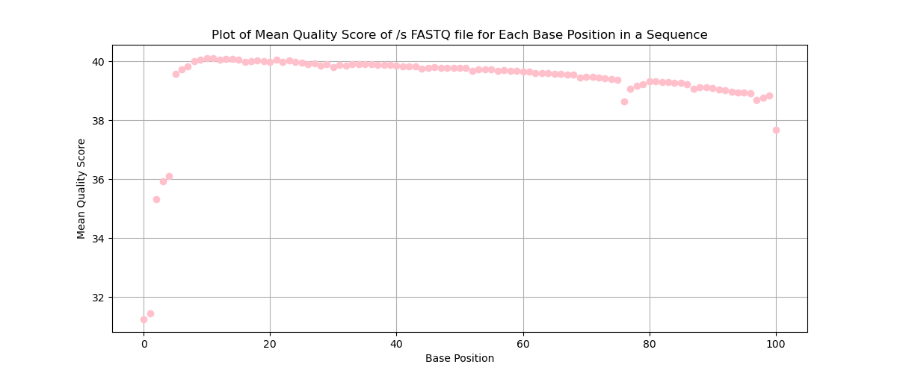
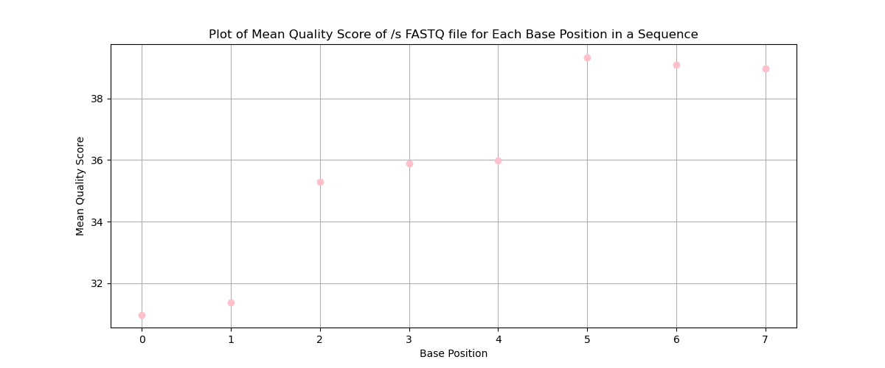
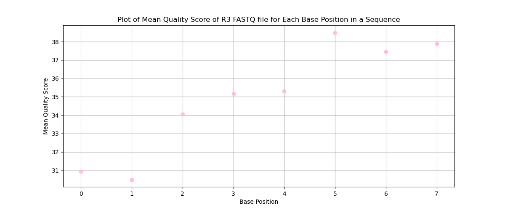

# Assignment the First

## Part 1
1. Be sure to upload your Python script: [python script](./part1.py) and [bash script](./part1.sh)

| File name | label | Read length | Phred encoding |
|---|---|---|---|
| 1294_S1_L008_R1_001.fastq.gz |  read1 | 101 | +33 |
| 1294_S1_L008_R2_001.fastq.gz | index R1 | 8 | +33 |
| 1294_S1_L008_R3_001.fastq.gz | index R2 | 8 | +33 |
| 1294_S1_L008_R4_001.fastq.gz | read 2 | 101 | +33 |

2. Per-base NT distribution
    1. Use markdown to insert your 4 histograms here.
    
    
    
    
    
## Part 2
1. Define the problem

   We have 4 files: read 1, index 1, read 2, and index 2. Read 1 corresponds with index 1 and read 2 corresponds with index2. I want to filter though each file and first check the quality score. If the score if below the threshold I assigned I will put it in an unknown file output. After quality filtering through each sequence and index, I will open all four files and go through each record and combine the record for read 1 and read 2 (example “AAAAAAAA-CCCCCCCC") at the end of the header for both read 1 and read 2. If the barcodes match, those records will go into output files for 'dual matched', if they do not match they will go into output 'index-hopped', and if the barcode is not one of the 24 known barcodes listed, it will go into output files 'unknown index'. 
   
3. Describe output

   I will have a total of 52 output FASTQ files.

   There will be 48 FASTQ files for dual matched barcodes. There are 24 different known barcodes, and each barcode will have 2 files: one for read 1 and one for read 2 (the name of the file for the first barcode will be barcode1_read1.fastq and barcode1_read2.fastq).

   There will be 2 FASTQ files for the index-hopped reads-pairs, one for read 1 and one for read 2 (the name of the file for hopped barcode would be hopped_read1.fastq and hopped_read2.fastq).

   There will be 2 FASTQ files for the unknown barcode records or low quality score records, one for read 1 and one for read 2 (the name of the file for undetermined barcode would be undetermined_read1.fastq and undetermined_read2.fastq). 
   
5. Upload your [4 input FASTQ files](../TEST-input_FASTQ) and your [>=6 expected output FASTQ files](../TEST-output_FASTQ).

6. Pseudocode

   argparse for 5 variables: 4 files and the quality score threshold

   open all 4 files `with open() as f1, open() as f2, open() as f3, open() as f4`

   initalize 3 variables to count for known, unknown, and hopped records
   
   initalize an empty dictionary to count all the times certain barcodes hopped

    - `while true` loop

       - read 4 lines at a time for each of the 4 files at once

       - put all 4 lines into lists so they have the format of `record1 = [<header>, <sequence>, <'+'>, <score>]`

       - `if` all four lines are false (empty newline) then break the loop

       *the rest of this code will run if the lines are not empty and we are still in the loop `else`*

       - call a `reverse complement function` on `record3[1]` and replacing it in the list

       - check the quality score of the barcodes by calling the `phred_score function` and storing them into variables

         `bar1qs = phred_score(record2[3])`
   
         `bar2qs = phred_score(record3[3])`
   
       - combine the barcodes into one string
   
           `combinded_barcode = barcode2 + '-' + barcode3`
   
        - append the combined barcode to the end of each header and replace the original header in the list with this new header

           `record1[0] = original_header + combinded_barcode`
   
        - `if` the `bar1qs` `or` `bar2qs` are below the quality score `<` `threshold` (regardless of if they are hopped, matched, or not)

           - output the entire record into a file `using with open('a')` named `undetermined_read1.fastq` and `undetermined_read2.fastq`
           - increment the unknown barcode counter

       *this code will run if the barcodes are not below the quality score threshold*
   
       - `if` the barcodes are the same as each other `==` `and` part of the 24 barcodes

         - output the entire record into a file `using with open('a')` named `barcode<x>_read1.fastq` and `barcode<x>_read2.fastq` where <x> is the number of the barcode
         - increment the known barcode counter
     
       - `if` the barcodes are different `=!` `and` part of the 24 barcodes

         - output the entire record into a file `using with open('a')` named `hopped_read1.fastq` and `hopped_read2.fastq`
         - increment the hopped counter
     
       - `if` the barcodes are not part of the 24 barcodes
     
         - output the entire record into a file `using with open('a')` named `undetermined_read1.fastq` and `undetermined_read2.fastq`
         - increment the unknown counter
   

8. High level functions. For each function, be sure to include:
    1. Description/doc string
    2. Function headers (name and parameters)
    3. Test examples for individual functions
    4. Return statement

Phred score function:
  
    def convert_phred(letter: str) -> int:
        '''Takes a single ASCII character (string) encoded in Phred+33 and
        returns the quality score value as an integer.'''
        return qscore
    Input: I
    Expected output: 40
       
Reverse complement function

    def rev_complement(barcode: str) -> str:
        '''Takes in a sequence that is DNA (string) and returns the complment of it
        as a string'''
    Input: AATG
    Expected output: TTAC

