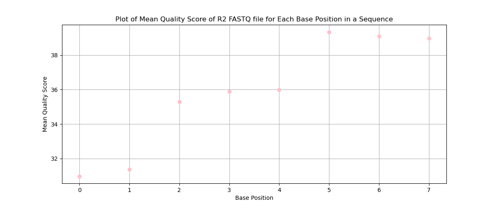

# Assignment the First

## Part 1
1. Be sure to upload your Python script: [python script](./part1.py) and [bash script](./part1.sh)

| File name | label | Read length | Phred encoding |
|---|---|---|---|
| 1294_S1_L008_R1_001.fastq.gz |  read1 | 101 | +33 |
| 1294_S1_L008_R2_001.fastq.gz | index R1 | 8 | +33 |
| 1294_S1_L008_R3_001.fastq.gz | index R2 | 8 | +33 |
| 1294_S1_L008_R4_001.fastq.gz | read 2 | 101 | +33 |

2. Per-base NT distribution
    1. Use markdown to insert your 4 histograms here.
    
    
    
    
    
3. What is a good quality score cutoff for index reads and biological read pairs to utilize for sample identification and downstream analysis, respectively? Justify your answer.

    I don't need a quality score cutoff because our 25 barcodes have a high hamming distance value. The hamming distance is how similar/different 2 sequences of the same length are to one another. A larger hamming distance value means that between 2 sequences multiple positions would need a nucleotide change in order for those 2 sequences to be the same. Since our 24 barcodes are pretty uniquely made and have a high hamming distance value, multiple nucleotides in a barcode would need to be incorretly sequenced to a specific nucleotide in order to match to another barcode. Because we are pretty confident in our barcodes, it is VERY **VERY** ***VERY*** unlikely that a barcode would be incorrectly sequenced and match another valid barcode.

4. How many indexes have undetermined (N) base calls? (Utilize your command line tool knowledge. Submit the command(s) you used. CHALLENGE: use a one-line command)

    `zcat /projects/bgmp/shared/2017_sequencing/1294_S1_L008_R2_001.fastq.gz | sed -n '2~4p' | grep -c "N"`
    The amount of indexes that have undetermined (N) base calls in index1 is: 3976613

    `zcat /projects/bgmp/shared/2017_sequencing/1294_S1_L008_R2_001.fastq.gz | sed -n '2~4p' | grep -c "N"`
    The amount of indexes that have undetermined (N) base calls in index2 is: 3328051

    The total amount of indexes that have undetermined (N) base calls: 7304664

## Part 2
1. Define the problem

   We have 4 files: read 1, index 1, read 2, and index 2. Read 1 corresponds with index 1 and read 2 corresponds with index2. I want to filter though each file and first check the quality score. If the score if below the threshold I assigned I will put it in an unknown file output. After quality filtering through each sequence and index, I will open all four files and go through each record and combine the record for read 1 and read 2 (example “AAAAAAAA-CCCCCCCC") at the end of the header for both read 1 and read 2. If the barcodes match, those records will go into output files for 'dual matched', if they do not match they will go into output 'index-hopped', and if the barcode is not one of the 24 known barcodes listed, it will go into output files 'unknown index'. 
   
3. Describe output

   I will have a total of 52 output FASTQ files.

   There will be 48 FASTQ files for dual matched barcodes. There are 24 different known barcodes, and each barcode will have 2 files: one for read 1 and one for read 2 (the name of the file for the first barcode will be barcode1_read1.fastq and barcode1_read2.fastq).

   There will be 2 FASTQ files for the index-hopped reads-pairs, one for read 1 and one for read 2 (the name of the file for hopped barcode would be hopped_read1.fastq and hopped_read2.fastq).

   There will be 2 FASTQ files for the unknown barcode records (this included barcodes with "N" base calls) low quality score records, one for read 1 and one for read 2 (the name of the file for undetermined barcode would be undetermined_read1.fastq and undetermined_read2.fastq). 
   
5. Upload your [4 input FASTQ files](../TEST-input_FASTQ) and your [>=6 expected output FASTQ files](../TEST-output_FASTQ).

6. Pseudocode

   argparse for 4 variables: each of the 4 input files 
   
   open/create all 52 files for writing

   initalize 3 variables to count for known, unknown, and hopped records
   
   initalize an empty dictionary to count all the times certain barcodes hopped and how many known barcodes there are

   create a `set` with all of the known barcodes

   open all 4 files `with open() as f1, open() as f2, open() as f3, open() as f4`

    - use `itertools.count` as a while loop but also count each line

       - read all file lines at a time and use `%` to get each record of 4 lines

       - put all 4 lines into lists so they have the format of `record1 = [<header>, <sequence>, <'+'>, <score>]`

       - `if` the lines are false (empty newline) then break the loop

       *the rest of this code will run if the lines are not empty and we are still in the loop `else`*

       - call a `reverse complement function` on `record3[1]` and replacing it in the list
   
       - combine the barcodes into one string
   
           `combinded_barcode = barcode2 + '-' + barcode3`
   
        - append the combined barcode to the end of each header and replace the original header in the list with this new header

          `record1[0] = original_header + combinded_barcode`
   
        - `if` the `bar1qs` `or` `bar2qs` are below the quality score `<` `threshold` (regardless of if they are hopped, matched, or not)

           - output the entire record into a file named `undetermined_read1.fastq` and `undetermined_read2.fastq`
           - increment the unknown barcode counter

       *this code will run if the barcodes are not below the quality score threshold*
   
       - `if` the barcodes are the same as each other `==` `and` part of the 24 barcodes

         - output the entire record into a file named `barcode<x>_read1.fastq` and `barcode<x>_read2.fastq` where <x> is the number of the barcode
         - increment the known barcode counter
     
       - `if` the barcodes are different `=!` `and` part of the 24 barcodes

         - output the entire record into a file named `hopped_read1.fastq` and `hopped_read2.fastq`
         - increment the hopped counter
     
       - `if` the barcodes are not part of the 24 barcodes
     
         - output the entire record into a file named `undetermined_read1.fastq` and `undetermined_read2.fastq`
         - increment the unknown counter
    
   close all 52 files
   

8. High level functions. For each function, be sure to include:
    1. Description/doc string
    2. Function headers (name and parameters)
    3. Test examples for individual functions
    4. Return statement

Phred score function:
  
    def convert_phred(letter: str) -> int:
        '''Takes a single ASCII character (string) encoded in Phred+33 and
        returns the quality score value as an integer.'''
        return qscore
    Input: I
    Expected output: 40
       
Reverse complement function

    def rev_complement(barcode: str) -> str:
        '''Takes in a sequence that is DNA (string) and returns the complment of it
        as a string'''
    Input: AATG
    Expected output: TTAC

